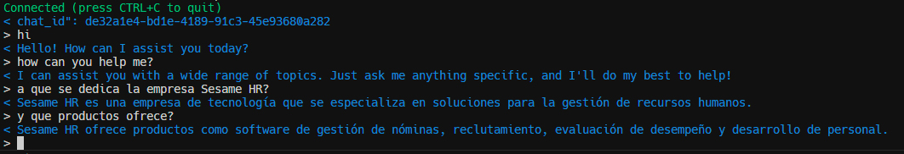

# Centauri Chat Service



Centauri Chat Service is a lightweight, scalable WebSocket-based AI chat service. It allows multiple conversational sessions to be maintained in memory, with a focus on modularity and extendibility. Built using FastAPI, it follows a **Hexagonal Architecture** to ensure flexibility and maintainability.

The service uses an **in-memory singleton pattern** to store data, suitable for low-demand scenarios. However, the architecture is designed to allow easy integration with **Redis** or traditional databases if higher scalability is required.

---

## **Features**

- **WebSocket Support**: Real-time communication through `/chat/` and `/chat/{chat_id}` endpoints.
- **Session Management**: Multiple conversations stored and managed in memory.
- **Health Check Endpoint**: `/check` to verify service status.
- **Hexagonal Architecture**: Clear separation of concerns, enabling future extensibility.
- **In-Memory Storage**: Uses a singleton pattern for low-demand use cases.
- **Extendable to Redis or Databases**: Ready for scaling with minimal changes.

---

## **Prerequisites**

1. **Python**: Version 3.9 or higher.
2. **Docker**: Ensure Docker is installed and running.
3. **Make**: For convenience in executing commands (optional, but recommended).

---

## **Setup Instructions**

Follow these steps to get the project up and running:

### 1. Clone the Repository

```bash
git clone git@github.com:Endika/Centauri.git
cd Centauri
```

### 2. Configure your .env file

```bash
echo "OPENAI_API_KEY=your-token" > .env
```

### 3. Build and run Docker

```bash
make build
make up
# or
docker-compose up --build -d
```

### 4. Chat

```bash
make chat
# or
docker exec -it centauri-client wscat -c ws://centauri:8000/chat/
```

### 4.1 Chat

```bash
make chat-flight
# or
docker exec -it centauri-client wscat -c ws://centauri:8000/chat/flight_attendant
```
